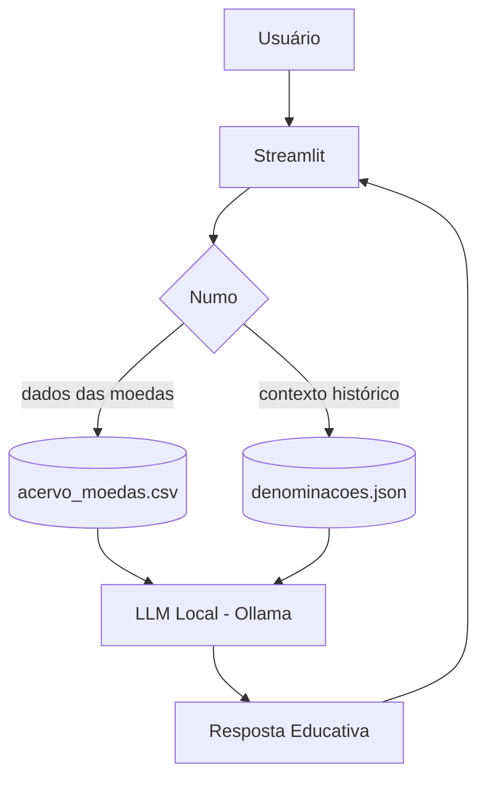

# 🪙 Numo — Curador Numismático Inteligente

> Agente de IA Generativa que **informa sobre os dados e ensina a história por trás das moedas** de um acervo.

## 💡 O Que é o Numo?

O Numo é um educador numismático que, além de fornecer informações sobre o seu acervo, explica o contexto histórico da moeda, em que época o sistema monetário circulou e o que veio antes e depois — sempre de forma didática e ancorada em uma base de conhecimento curada.

**O que o Numo faz:**

- ✅ Informa os dados da coleção a partir da base catalogada
- ✅ Contextualiza historicamente a denominação (Réis, Escudo, Dracma, Lira...)
- ✅ Ensina sobre o período monetário de forma simples
- ✅ Diz "não tenho esse dado" quando a informação não está na base

**O que o Numo NÃO faz:**

- ❌ Não crava valor de mercado nem precifica
- ❌ Não identifica moeda por foto
- ❌ Não afirma superlativos históricos sem respaldo ("a primeira", "a mais rara")
- ❌ Não recomenda comprar, vender, guardar ou investir

## 🏗️ Arquitetura



**Princípio condutor — Ancoragem Dupla:** o LLM nunca é a fonte dos fatos. Ele recebe os dados já extraídos dos arquivos curados e apenas os explica de forma didática.

**Stack:**

- Interface: Streamlit
- LLM: Ollama (modelo local, ex.: `qwen2.5`)
- Dados: CSV/JSON mockados em `data/`

## 📁 Estrutura do Projeto

```
├── data/                          # Base de conhecimento
│   ├── acervo_moedas.csv          # Camada 1 — inventário catalogado
│   ├── denominacoes.json          # Camada 2 — história dos sistemas monetários
│   └── perfil_colecionador.json   # Personalização do atendimento
│
├── docs/                          # Documentação completa
│   ├── 01-documentacao-agente.md  # Caso de uso, persona e arquitetura
│   ├── 02-base-conhecimento.md    # Estratégia de dados 
│   ├── 03-prompts.md              # System prompt e exemplos
│   ├── 04-metricas.md             # Avaliação de qualidade
│   └── 05-pitch.md                # Apresentação do projeto 
│
├── src/
│   └── app.py                     # Aplicação Streamlit 

```

## 🎯 Exemplo de Uso (previsto)

**Pergunta:** "Me fale sobre a moeda de 40 Réis de 1823."

**Numo:** "No seu acervo, essa é uma moeda de cobre, em estado MBC, guardada na Caixa 1. O *real* (no plural, *réis*) foi o sistema monetário que veio de Portugal e circulou no Brasil desde o período colonial até 1942, quando foi substituído pelo cruzeiro. Como os valores eram altos, era comum contar em milhares — o famoso 'mil-réis'. Quer saber quantas moedas de Réis você tem na coleção?

**Pergunta:** "Quanto ela vale hoje?"

**Numo:** "Eu não avalio preços — meu foco é contar a história das suas moedas. Para valor de mercado, o ideal é consultar catálogos especializados ou um avaliador. Você gostaria de saber alguma informação específica de alguma moeda do seu catálogo?

## 📊 Métricas de Avaliação (resumo)

| Métrica | Objetivo |
|---|---|
| **Assertividade** | O agente responde o que foi perguntado, usando a base? |
| **Segurança** | Evita inventar dados, preços e superlativos (anti-alucinação)? |
| **Coerência** | A resposta combina com o perfil e o tom didático? |

## 🎬 Diferenciais

- **Educativo:** foco em ensinar a história, não em precificar ou avaliar
- **Ancoragem dupla:** dados e contexto vêm de arquivos curados, não da "memória" do modelo
- **100% Local:** roda com Ollama, sem enviar dados do acervo para APIs externas
- **Honesto por design:** assume o que não sabe e ensina o caminho da pesquisa

## 📝 Documentação Completa

Toda a documentação técnica, estratégia de prompts e casos de teste estão na pasta [`docs/`](https://github.com/rafaeldaquino/DIO-Numo-O-Agente-Numismatico/tree/docs).

